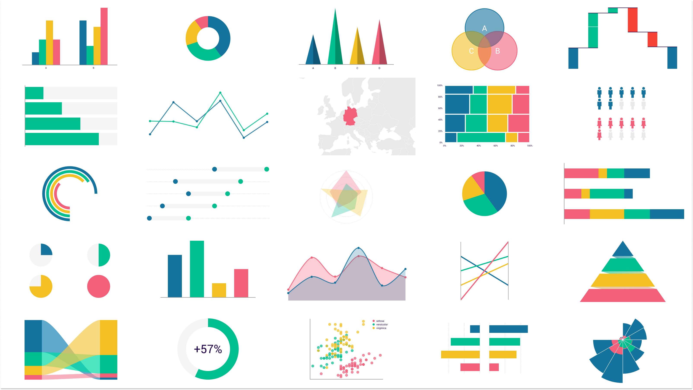

# Portfolio

# [Project_1: EDA datos siniestros viales CABA](https://github.com/Lapantufla/Data_Analysis/tree/CABA_Accident_EDA_project)

Los datos están relacionados con accidentes de siniestros viales en CABA. 

El objetivo es hacer un analisis exploratorio de los datos y plantear hipotesis.

[Link Presentacion en pdf](https://github.com/Lapantufla/Data_Analysis/blob/CABA_Accident_EDA_project/EDA%20Homicidios%20y%20accidentes%20viales.pdf)

[Link Notebook](https://github.com/Lapantufla/Data_Analysis/blob/CABA_Accident_EDA_project/homicidios_%26_accidentes%20(1).ipynb)

[Link DataFrames](https://data.buenosaires.gob.ar/dataset/victimas-siniestros-viales)

Las tareas que se realizaron son: 

* Feature Engineering:
  * Limpieza de datos crudos.
  * Creacion de nuevos features.
  * Implementacion de expresiones regulares. 
  * Scraping Web para la obtenencion de Barrios a partir de coordenadas(beautifulsoup).
    
* Visualización del DataFrame: 
  * Gráficos de histogramas.
  * Gráficos de barras.
  * Graficos de puntos.
  * Graficos de lineas.
  * Graficos de supervivencia.

* Planteode hipotesis.

* Implementacion modelo estadistico (survival analysis).

# [Project_2: Bank Marketing](https://github.com/Lapantufla/Data_Analysis/blob/BankMarketing_project/BankMarketing_project2_0.ipynb)

Los datos están relacionados con campañas de marketing (llamadas telefónicas) de una institución bancaria portuguesa. 
El objetivo de la clasificación es predecir si el cliente suscribirá o no a un depósito a plazo (variable y).

[Link Presentacion en pdf](https://github.com/Lapantufla/Data_Analysis/blob/BankMarketing_project/Bank%20Marketing%20presentacion.pdf)

[Link Notebook](https://github.com/Lapantufla/Data_Analysis/blob/BankMarketing_project/BankMarketing_project2_0.ipynb)

[Link DataFrame](https://www.kaggle.com/datasets/henriqueyamahata/bank-marketing?datasetId=30368&sortBy=voteCount)

Las tareas que se realizaron son: 

* EDA: 
  * Creacion de distintos graficos (distribuciones, barplots, countplots, regplots, etc..).
  * Calculo de probabilidades condicionales.
  * Plateo de hipotesis.

* Feature Engineering:
  * Discretizacion de variables.
  * Tratamiento de valores nulos.
  * Tratamiento de variables categóricas.
 
* Creación y entrenamiento modelos de clasificación:
  * Declaración y entrenamiento de modelos: knn, random forest y xgboost.
  * Análisis de la performance de los modelos.

# [Project_3: Age prediction](https://github.com/Lapantufla/ComputerVision/blob/AgePrediction/age_prediction.ipynb)

Se trabajo con el dataset UTK-face, se utilizo la cnn VGG16 para transfer learning y predecir la edad de las personas.

[Link DataFrame](https://susanqq.github.io/UTKFace/)

Las tareas que se realizaron son: 
 
* Selección y tratamiento de features.
  * Preprocesamiento de imagenes crudas.

* Modelado de red neuronal.
  * Transfer learning VGG16.
  * Seleccion de features.

# [Project_4: Analytics Employee Attrition & Performance](https://github.com/Lapantufla/Data_Analysis/blob/HumanResources_project/HumanResources_project.ipynb)

Descubra los factores que conducen a la deserción de los empleados, creando preguntas importantes y explorando posibles respuestas. 
Este es un conjunto de datos ficticio creado por científicos de datos de IBM.

[Link DataFrame](https://www.kaggle.com/datasets/pavansubhasht/ibm-hr-analytics-attrition-dataset?datasetId=1067&sortBy=voteCount)

Las tareas que se realizaron son: 

* Visualización del DataFrame: 
  * Gráficos de histogramas.
  * Gráficos de barras.
  * Gráficos de densidad.
  * Gráficos de cajas.
 
* Selección y tratamiento de features:
  * Tratamiento de variables categóricas ( con aprouch: Ordinal Encoding, Counting Encoding, Ordered Integer Encoding y Probability Ratio Encoding).
  * Analisis y tratamiento de cardinalidades y valores raros.
  * Seleccion de features.

* Creación y entrenamiento modelos de clasificación.
  * Escalado de datos.
  * Declaración y entrenamiento de modelo de regresión logística y random forest.
  * Análisis de la performance de los modelos.
